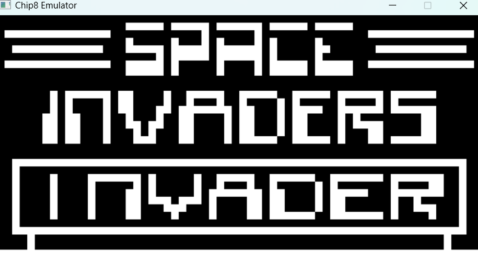

# CHIP8 Emulator

This is an emulator of the 1970's Chip-8 done in the C programming language, capable of running classic games such as space invaders, pong, etc.

Chip-8 is a simple, interpreted, programming language which was first used on some do-it-yourself computer systems in the late 1970s and early 1980s. The COSMAC VIP, DREAM 6800, and ETI 660 computers are a few examples. These computers typically were designed to use a television as a display, had between 1 and 4K of RAM, and used a 16-key hexadecimal keypad for input. The interpreter took up only 512 bytes of memory, and programs, which were entered into the computer in hexadecimal, were even smaller.

*Screenshots*: 

|  |  |
|:-------------------------------:|:--------------------------:|
| **Invaders**                    | **Pong**                   |